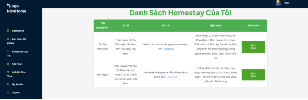

||
BỘ GIÁO DỤC VÀ ĐÀO TẠO

**TRƯỜNG ĐẠI HỌC CÔNG NGHỆ TP. HỒ CHÍ MINH**
|
| :- | :-: |

**ĐỒ ÁN CHUYÊN NGÀNH**

**XÂY DỰNG WEBSITE ĐẶT HOMESTAY** 

Ngành: 	**CÔNG NGHỆ THÔNG TIN**

Chuyên ngành: 	**CÔNG NGHỆ PHẦN MỀM**

Giảng viên hướng dẫn: ThS. Võ Tấn Dũng

Sinh viên thực hiện	: Võ Minh Hiếu	

MSSV: 2180607509	Lớp: 21DTHE3

TP. Hồ Chí Minh, 2024
# **LỜI MỞ ĐẦU**
Trong bối cảnh khoa học công nghệ không ngừng phát triển, các nền tảng trực tuyến đã và đang khẳng định vai trò quan trọng trong việc thay đổi cách con người tiếp cận các dịch vụ và sản phẩm trong mọi lĩnh vực, đặc biệt là du lịch và lưu trú. Việc tìm kiếm nơi lưu trú không chỉ dừng lại ở các phương pháp truyền thống mà đã được hiện đại hóa, mang đến sự tiện lợi và tối ưu hóa trải nghiệm cho người dùng. Đây chính là động lực để em xây dựng một trang web đặt và cho thuê homestay, nơi mang lại giải pháp hiệu quả và toàn diện cho cả du khách và chủ nhà.

Trang web của em hướng tới mục tiêu trở thành một nền tảng trung gian đáng tin cậy, hỗ trợ người dùng tìm kiếm và đặt chỗ lưu trú dễ dàng hơn. Em chú trọng phát triển các tính năng nổi bật như tìm kiếm linh hoạt, hiển thị thông tin chi tiết về từng homestay bao gồm vị trí, giá cả, tiện ích và hình ảnh thực tế. Người dùng cũng có thể quản lý việc đặt chỗ một cách nhanh chóng và dễ dàng thông qua hệ thống đặt phòng thông minh. Đối với chủ nhà sẽ được cung cấp các công cụ để quản lý homestay hiệu quả, giúp tối đa hóa lợi ích kinh doanh trong khi vẫn đảm bảo sự thuận tiện và trải nghiệm tốt nhất cho khách hàng.

Không chỉ là một nền tảng đặt chỗ mà còn là một người bạn đồng hành cùng người dùng trên những hành trình đáng nhớ. Từ những chuyến du lịch nghỉ dưỡng thư giãn đến những chuyến công tác ngắn ngày nền tảng này sẽ mang đến sự tiện nghi, thoải mái và trải nghiệm lưu trú độc đáo, giúp mọi hành trình trở nên trọn vẹn hơn.

Bằng sự nỗ lực và tâm huyết em hy vọng rằng trang web đặt và cho thuê homestay này sẽ không chỉ là công cụ hỗ trợ mà còn là cánh cửa kết nối cộng đồng, thúc đẩy sự phát triển bền vững của lĩnh vực du lịch và lưu trú tại Việt Nam.

# **LỜI CẢM ƠN**
Em xin gửi lời cảm ơn chân thành và lòng tri ân sâu sắc đến quý thầy cô của trường Đại học Công Nghệ TP.HCM, đặc biệt là các thầy cô khoa Công Nghệ Thông Tin, những người đã tận tình giảng dạy và trang bị cho em những kiến thức nền tảng quan trọng trong suốt quá trình học tập tại trường. Chính sự chỉ dạy tận tâm của thầy cô đã giúp em có thêm hành trang quý báu cho tương lai.

Em cũng xin bày tỏ lòng biết ơn sâu sắc đến thầy **Võ Tấn Dũng**, người đã tận tình hướng dẫn, chỉ bảo em trong suốt quá trình thực hiện đề tài. Sự hướng dẫn của thầy không chỉ giúp em hoàn thiện bài báo cáo này mà còn mang lại cho em nhiều kinh nghiệm và kiến thức thực tiễn bổ ích.

Trong quá trình học tập và thực hiện bài báo cáo, dù đã cố gắng hết sức, nhưng với kiến thức và kinh nghiệm còn hạn chế, em khó tránh khỏi những thiếu sót. Em rất mong nhận được sự thông cảm và ý kiến đóng góp quý báu từ thầy để em có thể rút ra bài học và hoàn thiện tốt hơn trong các bài báo cáo sau này.

Một lần nữa, em xin chân thành cảm ơn quý thầy cô và đặc biệt là thầy **Võ Tấn Dũng** đã luôn đồng hành và tạo điều kiện để em hoàn thành tốt bài báo cáo này.

**Sinh viên thực hiện**
`          `Võ Minh Hiếu

# MỤC LỤC
[LỜI MỞ ĐẦU	0****](#_toc186104365)**

[**LỜI CẢM ƠN	2****](#_toc186104366)

[**CHƯƠNG 1: TỔNG QUAN VỀ ĐỀ TÀI	6****](#_toc186104367)

[1.1 Lý do chọn đề tài	6](#_toc186104368)

[1.2 Mục đích của đề tài	7](#_toc186104369)

[1.2.1 Cung cấp công cụ tìm kiếm homestay hiệu quả và tiện lợi	7](#_toc186104370)

[1.2.2 Hệ thống đặt phòng và thanh toán trực tuyến an toàn, nhanh chóng	7](#_toc186104371)

[1.2.3 Quản lý homestay và đặt phòng cho chủ nhà	7](#_toc186104372)

[1.2.4 Cải thiện tính năng phản hồi và đánh giá giữa khách thuê và chủ nhà	8](#_toc186104373)

[1.2.5 Bảo mật và an toàn trong các giao dịch và thông tin người dùng	8](#_toc186104374)

[1.2.6 Cung cấp công cụ phân tích và báo cáo cho quản trị viên	8](#_toc186104375)

[1.2.7 Nâng cao trải nghiệm người dùng	8](#_toc186104376)

[1.3 Đối tượng nghiên cứu	9](#_toc186104377)

[1.3.1 Khách thuê (Guest):	9](#_toc186104378)

[1.3.2 Chủ nhà (Host):	9](#_toc186104379)

[1.3.3 Quản trị viên (Admin):	9](#_toc186104380)

[1.3.4 Hệ thống thanh toán (Payment System):	9](#_toc186104381)

[1.3.5 Khách viếng thăm (Visitor):	10](#_toc186104382)

[1.4 Phạm vi nghiên cứu	10](#_toc186104383)

[1.4.1 Phạm vi chức năng:	10](#_toc186104384)

[1.4.2 Phạm vi đối tượng người dùng:	10](#_toc186104385)

[1.4.3 Phạm vi công nghệ:	10](#_toc186104386)

[1.4.4 Phạm vi tính năng thanh toán:	11](#_toc186104387)

[1.4.5 Phạm vi địa lý:	11](#_toc186104388)

[1.4.6 Phạm vi thời gian:	11](#_toc186104389)

[1.5 Quy trình nghiệp vụ	11](#_toc186104390)

[1.5.1 Quy trình nghiệp vụ cho khách thuê (Guest)	11](#_toc186104391)

[1.5.2 Quy trình nghiệp vụ cho chủ nhà (Host)	13](#_toc186104392)

[1.5.3 Quy trình nghiệp vụ cho quản trị viên (Admin)	14](#_toc186104393)

[1.5.4 Quy trình nghiệp vụ cho hệ thống thanh toán (Payment System)	14](#_toc186104394)

[1.5.5 Quy trình nghiệp vụ cho khách viếng thăm (Visitor)	15](#_toc186104395)

[**CHƯƠNG 2: CƠ SỞ LÝ THUYẾT	16****](#_toc186104396)

[2.1 Giới thiệu ngôn ngữ, framework và công nghệ xây dựng website	16](#_toc186104397)

[2.1.1 Môi trường Node.js	16](#_toc186104398)

[2.1.2 Hệ quản trị cơ sở dữ liệu MySQL	17](#_toc186104399)

[2.1.3 Template engine Embedded JavaScript (EJS):	18](#_toc186104400)

[2.1.4 Dịch vụ lưu trữ Google Cloud Storage	19](#_toc186104401)

[2.1.5 MOMO API	20](#_toc186104402)

[2.2 Phân tích và thiết kế cơ sở dữ liệu	22](#_toc186104403)

[2.2.1 Mô hình Class Diagram	22](#_toc186104404)

[**CHƯƠNG 3: KẾT QUẢ THỰC NGHIỆM	23****](#_toc186104405)

[3.1 Sơ đồ ERD	23](#_toc186104406)

[3.2 Sơ đồ use case tổng quát	24](#_toc186104407)

[3.3 Các Use Case phân rã chức năng	24](#_toc186104408)

[3.4 Sơ đồ tuần tự	27](#_toc186104409)

[3.5 Sơ đồ Active	29](#_toc186104410)

[3.6 Giao diện ứng dụng đặt Homestay	30](#_toc186104411)

[**CHƯƠNG 4: KẾT LUẬN VÀ KIẾN NGHỊ	38****](#_toc186104412)

[4.1 Kết quả đạt được	38](#_toc186104413)

[4.2 Đánh giá phần mềm	39](#_toc186104414)

[4.2.1 Ưu điểm:	39](#_toc186104415)

[4.2.2Nhược điểm:	40](#_toc186104416)

[4.3 Định hướng phát triển	40](#_toc186104417)

[4.3.1 Nâng cao hiệu năng:	40](#_toc186104418)

[4.3.2 Phát triển thêm tính năng:	41](#_toc186104419)

[4.3.3 Cải thiện trải nghiệm người dùng:	41](#_toc186104420)

[4.3.4 Tăng cường bảo mật:	41](#_toc186104421)

[4.3.5 Hỗ trợ chủ nhà tốt hơn:	41](#_toc186104422)

[**TÀI LIỆU THAM KHẢO	42****](#_toc186104423)

# **CHƯƠNG 1: TỔNG QUAN VỀ ĐỀ TÀI**
1. **Lý do chọn đề tài**

Trong những năm gần đây, ngành du lịch và các dịch vụ lưu trú trực tuyến đang phát triển mạnh mẽ, đặc biệt là mô hình cho thuê homestay. Homestay không chỉ là một lựa chọn lưu trú tiện lợi mà còn mang đến cho du khách những trải nghiệm đặc biệt, gần gũi với cuộc sống và văn hóa địa phương. Bên cạnh đó, xu hướng số hóa và sự phát triển của công nghệ thông tin đã tạo điều kiện cho các dịch vụ trực tuyến trở thành công cụ thiết yếu trong cuộc sống hiện đại.

Với sự phát triển của Internet và các thiết bị di động, người dùng ngày càng có xu hướng tìm kiếm thông tin, dịch vụ và thực hiện các giao dịch qua các nền tảng trực tuyến. Chính vì vậy, việc xây dựng một hệ thống đặt phòng và cho thuê homestay trực tuyến sẽ không chỉ đáp ứng nhu cầu cấp thiết của khách hàng mà còn góp phần thúc đẩy sự phát triển của ngành du lịch, mở rộng cơ hội kinh doanh cho các chủ homestay.

Đề tài "Xây dựng website đặt và cho thuê homestay" được lựa chọn xuất phát từ thực tế nhu cầu ngày càng tăng đối với dịch vụ này. Trước sự đa dạng của các loại hình lưu trú và sự phát triển mạnh mẽ của các nền tảng dịch vụ trực tuyến, việc xây dựng một website đơn giản nhưng đầy đủ chức năng giúp khách hàng và chủ nhà dễ dàng kết nối với nhau là vô cùng cần thiết. Một nền tảng đặt và cho thuê homestay không chỉ giúp khách hàng có thể tìm kiếm các homestay phù hợp với yêu cầu của mình, mà còn giúp chủ nhà dễ dàng quản lý đặt phòng, thanh toán và thu nhập.

Hơn nữa, việc phát triển hệ thống này còn giúp giải quyết nhiều vấn đề liên quan đến quản lý thông tin, bảo mật dữ liệu, quy trình thanh toán trực tuyến và quản lý dịch vụ. Với mục tiêu cải thiện chất lượng dịch vụ và trải nghiệm của khách hàng, đề tài này sẽ đóng góp một phần vào sự phát triển của thị trường homestay trực tuyến.

1. **Mục đích của đề tài**

Mục đích của đề tài "Xây dựng website đặt và cho thuê homestay" là xây dựng một nền tảng trực tuyến có thể đáp ứng được nhu cầu của cả khách thuê và chủ nhà, đồng thời cải thiện trải nghiệm người dùng thông qua việc tối ưu hóa quy trình tìm kiếm, đặt phòng, thanh toán và quản lý dịch vụ. Cụ thể, mục đích của đề tài này bao gồm:

1. *Cung cấp công cụ tìm kiếm homestay hiệu quả và tiện lợi:*

   Mục tiêu là tạo ra một công cụ tìm kiếm mạnh mẽ, giúp khách thuê dễ dàng tìm kiếm các homestay phù hợp với yêu cầu về địa điểm, giá cả, tiện nghi, đánh giá từ những khách hàng trước đó, từ đó nâng cao khả năng tìm được nơi lưu trú lý tưởng cho chuyến đi của mình. Các bộ lọc tìm kiếm như giá, vị trí, tiện nghi, xếp hạng và các yếu tố khác sẽ giúp khách thuê dễ dàng thu hẹp phạm vi lựa chọn.

1. *Hệ thống đặt phòng và thanh toán trực tuyến an toàn, nhanh chóng:*

   Hỗ trợ khách thuê đặt phòng homestay ngay sau khi tìm được nơi ưng ý, đồng thời tính toán chi phí chính xác, bao gồm cả các khoản phụ thu nếu có. Hệ thống thanh toán cần được tích hợp với các cổng thanh toán trực tuyến, đảm bảo tính bảo mật, an toàn thông tin của khách hàng. Sau khi thanh toán thành công, trạng thái đặt phòng sẽ được cập nhật, giúp khách thuê và chủ nhà nắm rõ tình trạng đặt phòng.

1. *Quản lý homestay và đặt phòng cho chủ nhà:*

   Mục đích là cung cấp cho chủ nhà các công cụ để đăng ký, quản lý homestay, kiểm tra tình trạng của các yêu cầu đặt phòng và theo dõi thu nhập từ việc cho thuê homestay. Chủ nhà sẽ có thể dễ dàng duy trì thông tin homestay, thay đổi giá cả, cập nhật tình trạng sẵn có của homestay và thông báo với khách thuê về trạng thái của đặt phòng. Hệ thống sẽ giúp chủ nhà tự động hóa các quy trình quản lý và nâng cao hiệu quả công việc.

1. *Cải thiện tính năng phản hồi và đánh giá giữa khách thuê và chủ nhà:*

   Sau mỗi chuyến đi, khách thuê sẽ có thể viết đánh giá về homestay mà mình đã ở, giúp các khách hàng tiếp theo có thêm thông tin để đưa ra quyết định. Bên cạnh đó, chủ nhà cũng có thể phản hồi các đánh giá của khách thuê, từ đó cải thiện chất lượng dịch vụ và xây dựng mối quan hệ tốt hơn với khách hàng. Việc đánh giá và phản hồi sẽ góp phần xây dựng sự minh bạch và tin tưởng trong mối quan hệ giữa khách thuê và chủ nhà.

1. *Bảo mật và an toàn trong các giao dịch và thông tin người dùng:*

   Bảo mật là một yếu tố quan trọng trong các giao dịch trực tuyến, đặc biệt là trong các hệ thống xử lý thanh toán. Mục tiêu của đề tài là xây dựng các biện pháp bảo mật mạnh mẽ để bảo vệ thông tin cá nhân và thông tin thanh toán của khách hàng, giúp người dùng yên tâm khi thực hiện các giao dịch trên nền tảng. Việc bảo vệ dữ liệu người dùng sẽ giúp xây dựng lòng tin và thu hút nhiều người sử dụng hệ thống.

1. *Cung cấp công cụ phân tích và báo cáo cho quản trị viên:*

   Mục đích là giúp quản trị viên có thể theo dõi và giám sát các giao dịch, hoạt động của người dùng và tình trạng của các homestay. Các báo cáo về giao dịch, đánh giá và hoạt động của hệ thống sẽ giúp quản trị viên phát hiện sớm các vấn đề và đưa ra biện pháp giải quyết kịp thời, đảm bảo hệ thống hoạt động ổn định và hiệu quả.

1. *Nâng cao trải nghiệm người dùng:*

   Cuối cùng, một trong những mục đích quan trọng của đề tài là xây dựng một giao diện người dùng thân thiện, dễ sử dụng và phù hợp với mọi đối tượng, từ khách thuê đến chủ nhà và quản trị viên. Giao diện sẽ được thiết kế đơn giản, dễ hiểu và thuận tiện cho người dùng khi tìm kiếm, đặt phòng, thanh toán và quản lý các hoạt động liên quan.

1. **Đối tượng nghiên cứu**

Đối tượng nghiên cứu của đề tài "Xây dựng website đặt và cho thuê homestay" là hệ thống quản lý và giao dịch giữa các đối tượng người dùng trong nền tảng homestay trực tuyến, bao gồm:

1. *Khách thuê (Guest):* 

   Đây là người dùng chủ yếu tìm kiếm và đặt phòng homestay, thực hiện giao dịch thanh toán, cũng như viết đánh giá về dịch vụ sau khi sử dụng. Nghiên cứu sẽ tập trung vào nhu cầu và hành vi của khách thuê trong quá trình tìm kiếm homestay, đặt phòng, thanh toán và đánh giá dịch vụ.

1. *Chủ nhà (Host):*

   ` `Chủ nhà là đối tượng cung cấp homestay trên nền tảng, quản lý các homestay của mình, xác nhận hoặc từ chối yêu cầu đặt phòng, phản hồi đánh giá của khách thuê và theo dõi thu nhập từ việc cho thuê. Nghiên cứu sẽ phân tích các yêu cầu của chủ nhà liên quan đến việc đăng ký và quản lý thông tin homestay, đồng thời cung cấp các công cụ để quản lý giao dịch hiệu quả.

1. *Quản trị viên (Admin):* 

   Đây là đối tượng quản lý và giám sát các hoạt động của hệ thống, bao gồm quản lý người dùng, duyệt và phê duyệt homestay, giám sát giao dịch, xử lý khiếu nại, tranh chấp và đảm bảo hoạt động của nền tảng diễn ra suôn sẻ. Nghiên cứu sẽ bao gồm việc xây dựng các công cụ và giao diện dành cho quản trị viên để quản lý hệ thống hiệu quả.

1. *Hệ thống thanh toán (Payment System):* 

   Đây là thành phần quan trọng trong nền tảng, xử lý các giao dịch thanh toán, đảm bảo tính an toàn và bảo mật của thông tin thanh toán. Đối tượng nghiên cứu sẽ bao gồm việc tích hợp các cổng thanh toán, xác thực thông tin và xử lý các yêu cầu hoàn tiền hoặc hủy giao dịch.

1. *Khách viếng thăm (Visitor):* 

   Đây là những người truy cập trang web và tìm kiếm thông tin về homestay, nhưng chưa đăng ký tài khoản. Nghiên cứu sẽ khảo sát cách khách viếng thăm tìm kiếm thông tin và chuyển đổi thành khách thuê hoặc chủ nhà.

1. **Phạm vi nghiên cứu**
   1. *Phạm vi chức năng:* 

      Đề tài nghiên cứu và phát triển một website đặt và cho thuê homestay, bao gồm các chức năng chính như tìm kiếm và đặt phòng, thanh toán trực tuyến, đánh giá dịch vụ, quản lý homestay, quản lý đặt phòng và thu nhập cho chủ nhà, và các công cụ quản lý hệ thống cho quản trị viên. Các chức năng này sẽ được triển khai trên nền tảng web và sẽ tối ưu hóa cho các thiết bị di động, đảm bảo người dùng có thể sử dụng hệ thống mọi lúc, mọi nơi.

   1. *Phạm vi đối tượng người dùng:*

      Đề tài sẽ nghiên cứu và phát triển hệ thống dành cho 4 nhóm đối tượng người dùng chính: khách thuê, chủ nhà, quản trị viên và hệ thống thanh toán. Trong đó, khách thuê và chủ nhà là hai nhóm người dùng chính tương tác trực tiếp với nền tảng, trong khi quản trị viên và hệ thống thanh toán đảm bảo sự vận hành và tính bảo mật của hệ thống. Các yêu cầu từ những đối tượng này sẽ được nghiên cứu và phản ánh trong quy trình phát triển hệ thống.

   1. *Phạm vi công nghệ:*

      Website sẽ được xây dựng với các công nghệ web hiện đại, sử dụng HTML, CSS, JavaScript. Hệ thống backend sẽ được xây dựng bằng công nghệ Node.js tích hợp với cơ sở dữ liệu MySQL để lưu trữ và quản lý thông tin người dùng, homestay, đặt phòng và thanh toán.

   1. *Phạm vi tính năng thanh toán:*

      Hệ thống thanh toán sẽ tích hợp với các cổng thanh toán trực tuyến phổ biến như VNPay và MOMO, đảm bảo thanh toán được thực hiện an toàn và bảo mật. Phạm vi nghiên cứu sẽ tập trung vào việc xử lý giao dịch thanh toán, xác thực thông tin người dùng và đảm bảo quy trình hoàn tiền hoặc hủy giao dịch hiệu quả.

   1. *Phạm vi địa lý:*

      Đề tài này sẽ không giới hạn trong một khu vực cụ thể, nhưng nền tảng sẽ có khả năng mở rộng để phục vụ cho các khách thuê và chủ nhà ở nhiều địa phương khác nhau, đồng thời hỗ trợ các ngôn ngữ và tiền tệ khác nhau trong trường hợp cần thiết.

   1. *Phạm vi thời gian:*

      Nghiên cứu và phát triển hệ thống sẽ được thực hiện trong một khoảng thời gian xác định, từ việc phân tích yêu cầu, thiết kế hệ thống, lập trình, kiểm thử cho đến triển khai và hoàn thiện các tính năng của website.

1. **Quy trình nghiệp vụ**

Quy trình nghiệp vụ trong hệ thống đặt và cho thuê homestay bao gồm các bước tương tác giữa các đối tượng người dùng, từ khách thuê, chủ nhà, quản trị viên, đến hệ thống thanh toán. Các nghiệp vụ này được thiết kế để tối ưu hóa trải nghiệm người dùng và đảm bảo tính hiệu quả, bảo mật và minh bạch trong toàn bộ hệ thống.

1. *Quy trình nghiệp vụ cho khách thuê (Guest)*
   1. Tìm kiếm homestay:

      - Bước 1: Khách thuê truy cập vào trang chủ của website và sử dụng công cụ tìm kiếm để nhập các thông tin cơ bản như địa điểm, ngày nhận phòng, ngày trả phòng, số lượng người ở, giá cả và tiện nghi mong muốn.

      - Bước 2: Hệ thống lọc các homestay phù hợp với các tiêu chí tìm kiếm và hiển thị danh sách kết quả.

      - Bước 3: Khách thuê có thể sử dụng các bộ lọc nâng cao để tìm kiếm chi tiết hơn, như đánh giá của khách trước, khoảng cách từ điểm du lịch, các tiện nghi đặc biệt, v.v.

      - Bước 4: Hệ thống cung cấp thông tin chi tiết về từng homestay, bao gồm ảnh, mô tả, tiện nghi, giá thuê và các đánh giá từ khách trước.

   1. Đặt phòng homestay

      - Bước 1: Khách thuê chọn homestay phù hợp và tiến hành đặt phòng bằng cách nhập ngày nhận phòng và trả phòng.

      - Bước 2: Hệ thống kiểm tra tính khả dụng của homestay cho các ngày được chọn và thông báo cho khách thuê.

      - Bước 3: Chờ chủ nhà xác nhận yêu cầu đặt phòng và tiến hành thanh toán.

      - Bước 4: Sau khi chủ nhà xác nhận yêu cầu đặt phòng, khách thuê có thể thanh toán cho yêu cầu đặt phòng.

   1. Thanh toán cho yêu cầu đặt phòng

      - Bước 1: Sau khi chủ nhà xác nhận yêu cầu đặt phòng, khách thuê được yêu cầu thanh toán.

      - Bước 2: Khách thuê thực hiện thanh toán thông qua các cổng thanh toán trực tuyến (VNPay, PayPal, v.v.).

      - Bước 3: Hệ thống xác thực thông tin thanh toán và xác nhận giao dịch.

      - Bước 4: Nếu giao dịch thành công, hệ thống cập nhật trạng thái đặt phòng thành "đã thanh toán". Nếu có vấn đề về thanh toán, khách thuê sẽ được thông báo và yêu cầu thực hiện lại giao dịch.

   1. Quản lý đặt phòng

      - Bước 1: Khách thuê có thể truy cập vào trang "Quản lý đặt phòng" để xem danh sách các đặt phòng đã thực hiện.

      - Bước 2: Tại đây, khách thuê có thể kiểm tra chi tiết các phòng đang chờ chủ nhà chấp nhận và có thể hủy bỏ yêu cầu đặt phòng.

   1. Viết đánh giá cho homestay

      - Bước 1: Sau khi kết thúc kỳ nghỉ và trả phòng, khách thuê có thể viết đánh giá về homestay.

      - Bước 2: Đánh giá bao gồm điểm số trân thang điểm 5 và nhận xét chi tiết về chất lượng dịch vụ, tiện nghi và trải nghiệm chung.

      - Bước 3: Hệ thống lưu trữ đánh giá và cập nhật lại xếp hạng tổng thể của homestay.

1. *Quy trình nghiệp vụ cho chủ nhà (Host)*
   1. Đăng ký và quản lý homestay

      - Bước 1: Chủ nhà đăng ký tài khoản trên hệ thống hoặc đăng nhập vào tài khoản đã có.

      - Bước 2: Chủ nhà thêm homestay mới vào hệ thống bằng cách nhập thông tin chi tiết về homestay (tiêu đề, mô tả, giá, địa điểm, tiện nghi).

      - Bước 3: Chủ nhà quản lý hình ảnh, tiện nghi và các thông tin khác của homestay, cập nhật trạng thái của homestay (sẵn sàng hay không có sẵn).

   1. Quản lý đặt phòng

      - Bước 1: Chủ nhà theo dõi và quản lý các yêu cầu đặt phòng từ khách thuê.

      - Bước 2: Chủ nhà có thể chấp nhận hoặc từ chối yêu cầu đặt phòng dựa trên tình trạng homestay và các chính sách.

      - Bước 3: Hệ thống gửi thông báo cho khách thuê về việc xác nhận hoặc từ chối yêu cầu.

   1. Theo dõi thu nhập và thanh toán

      - Bước 1: Chủ nhà có thể theo dõi thu nhập từ việc cho thuê homestay qua trang quản lý thu nhập.

      - Bước 2: Hệ thống hiển thị thông tin về doanh thu, các thanh toán đã hoàn tất và các thanh toán đang chờ xử lý.

      - Bước 3: Chủ nhà có thể xem lịch sử giao dịch và tổng hợp thu nhập theo thời gian.

1. *Quy trình nghiệp vụ cho quản trị viên (Admin)*
   1. Quản lý người dùng

      - Bước 1: Quản trị viên xem xét danh sách người dùng và trạng thái tài khoản của họ.

      - Bước 2: Quản trị viên có thể cập nhật thông tin người dùng, khóa tài khoản nếu người dùng vi phạm chính sách.

      - Bước 3: Hệ thống gửi thông báo cho người dùng khi tài khoản bị khóa hoặc bị cập nhật thông tin.

   1. Phê duyệt homestay

      - Bước 1: Quản trị viên kiểm tra các homestay mới đăng ký từ chủ nhà.

      - Bước 2: Quản trị viên duyệt hoặc từ chối homestay dựa trên các tiêu chí kiểm tra như thông tin mô tả, hình ảnh, v.v.

      - Bước 3: Quản trị viên gửi thông báo cho chủ nhà về quyết định duyệt hay từ chối homestay.

   1. Xử lý khiếu nại và tranh chấp

      - Bước 1: Quản trị viên nhận thông báo về khiếu nại từ khách thuê hoặc chủ nhà.

      - Bước 2: Quản trị viên liên hệ với các bên liên quan để làm rõ vấn đề và đưa ra quyết định giải quyết hợp lý.

1. *Quy trình nghiệp vụ cho hệ thống thanh toán (Payment System)*
   1. Xử lý thanh toán

      - Bước 1: Khách thuê thực hiện thanh toán qua hệ thống cổng thanh toán trực tuyến.

      - Bước 2: Hệ thống xác thực thông tin thanh toán và gửi thông báo kết quả thanh toán.

      - Bước 3: Nếu giao dịch thành công, hệ thống cập nhật trạng thái đặt phòng và chuyển tiền vào tài khoản của chủ nhà.

   1. Hoàn tiền hoặc hủy giao dịch

      - Bước 1: Khách thuê yêu cầu hoàn tiền khi hủy đặt phòng hoặc có vấn đề về dịch vụ.

      - Bước 2: Hệ thống kiểm tra điều kiện hoàn tiền và xử lý giao dịch hoàn tiền.

      - Bước 3: Hệ thống gửi thông báo hoàn tiền hoặc hủy giao dịch cho khách thuê và chủ nhà.

1. *Quy trình nghiệp vụ cho khách viếng thăm (Visitor)*
   1. Tìm kiếm homestay

      - Bước 1: Khách viếng thăm sử dụng công cụ tìm kiếm để tìm kiếm homestay mà không cần đăng nhập.

      - Bước 2: Hệ thống cung cấp kết quả tìm kiếm và thông tin chi tiết về các homestay.

   1. Đăng ký tài khoản

      - Bước 1: Khách viếng thăm đăng ký tài khoản để trở thành khách thuê hoặc chủ nhà.

      - Bước 2: Hệ thống gửi email xác minh và hoàn tất quá trình đăng ký tài khoản.

**
# **CHƯƠNG 2: CƠ SỞ LÝ THUYẾT**
## 2.1 Giới thiệu ngôn ngữ, framework và công nghệ xây dựng website
### *2.1.1 Môi trường Node.js*
Node.js là một môi trường chạy JavaScript phía server, được xây dựng trên công cụ V8 JavaScript Engine của Google. Ra mắt vào năm 2009 bởi Ryan Dahl, Node.js đã mở rộng phạm vi sử dụng của JavaScript từ phía client (trình duyệt) sang phía server, tạo nên một môi trường linh hoạt và hiệu quả cho việc xây dựng các ứng dụng web hiện đại. Cho phép các nhà phát triển xây dựng ứng dụng web tốc độ cao, sử dụng JavaScript làm ngôn ngữ chính.

` 				       `Hình 2.1.1 môi trường nodejs

1. Đặc điểm nổi bật của Node.js

   - Mô hình bất đồng bộ (Asynchronous):Node.js sử dụng mô hình xử lý sự kiện bất đồng bộ (non-blocking I/O), cho phép thực hiện nhiều tác vụ cùng lúc mà không cần chờ đợi một tác vụ hoàn thành. Điều này làm tăng hiệu suất của ứng dụng, đặc biệt là với các ứng dụng xử lý nhiều yêu cầu đồng thời.

   **-** Kiến trúc đơn luồng (Single-threaded):** Mặc dù Node.js sử dụng kiến trúc đơn luồng, nhưng nhờ vào cơ chế xử lý sự kiện, nó có thể xử lý hàng nghìn kết nối đồng thời mà không cần tạo nhiều luồng.

   **-** Khả năng mở rộng (Scalability): Node.js dễ dàng mở rộng để xử lý nhiều yêu cầu bằng cách sử dụng các module như Cluster, cho phép tận dụng tối đa tài nguyên CPU.

   - Cộng đồng lớn và hệ sinh thái phong phú:** Node.js có một cộng đồng mạnh mẽ và một hệ sinh thái phong phú với hơn một triệu thư viện có sẵn trên** npm** (Node Package Manager)**,** giúp tăng tốc quá trình phát triển và triển khai ứng dụng.

1. Vai trò của Node.js trong dữ án

   - Xử lý các yêu cầu từ client, bao gồm tìm kiếm homestay, đặt phòng và thanh toán.

   - Tích hợp với cơ sở dữ liệu để lưu trữ và quản lý thông tin người dùng, homestay, và giao dịch.

   - Kết nối với các API của bên thứ ba như hệ thống thanh toán (MOMO) để xử lý giao dịch trực tuyến.

   - Tối ưu hóa hiệu suất và hỗ trợ xử lý đồng thời nhiều yêu cầu từ người dùng.

1. *Hệ quản trị cơ sở dữ liệu MySQL*

   MySQL là một hệ quản trị cơ sở dữ liệu mã nguồn mở phổ biến, được phát triển và duy trì bởi Oracle Corporation. Với khả năng quản lý cơ sở dữ liệu quan hệ (Relational Database Management System - RDBMS), MySQL được thiết kế để xử lý các khối lượng dữ liệu lớn và hỗ trợ nhiều tác vụ khác nhau, từ các ứng dụng nhỏ đến các hệ thống phức tạp. MySQL sử dụng ngôn ngữ SQL (Structured Query Language) để thao tác với dữ liệu, cung cấp một môi trường mạnh mẽ và dễ sử dụng cho các nhà phát triển. Hệ thống này đã trở thành một trong những lựa chọn hàng đầu cho việc xây dựng các ứng dụng web và các hệ thống lớn nhờ tính ổn định, hiệu suất cao và khả năng tích hợp với nhiều ngôn ngữ lập trình.

Hình 2.1.2 Hệ quản trị cơ sở dữ liệu MySQL

1. Ưu điểm của MySQL

   - Dễ học và sử dụng: MySQL có cú pháp SQL đơn giản, phù hợp cho cả người mới bắt đầu và nhà phát triển có kinh nghiệm.

   - Hiệu suất cao: Tốc độ truy vấn nhanh, ngay cả khi xử lý các cơ sở dữ liệu lớn.

   - Miễn phí: MySQL là mã nguồn mở, giúp tiết kiệm chi phí phát triển và vận hành.

   - Tích hợp tốt với các ngôn ngữ lập trình: MySQL có thể tích hợp dễ dàng với Node.js, PHP, Python, Java và nhiều ngôn ngữ khác.

1. Vai trò của MySQL trong dự án

   MySQL đóng vai trò là nền tảng lưu trữ và quản lý dữ liệu cốt lõi cho toàn bộ hệ thống. Với các đặc điểm nổi bật về hiệu suất và khả năng mở rộng, MySQL sẽ hỗ trợ:

   - Tối ưu hóa quá trình truy xuất và xử lý dữ liệu.

   - Đảm bảo tính nhất quán và bảo mật dữ liệu trong suốt vòng đời của hệ thống.

   - Cung cấp công cụ phân tích dữ liệu hỗ trợ các chức năng nâng cao như báo cáo thu nhập, thống kê lượt đặt phòng, và đánh giá chất lượng dịch vụ.

1. *Template engine Embedded JavaScript (EJS):*

   EJS (Embedded JavaScript) là một template engine dành cho Node.js, cho phép nhúng mã JavaScript vào HTML để tạo ra các trang web động. EJS, có thể dễ dàng truyền dữ liệu từ backend lên giao diện frontend, tạo ra các trang web được cá nhân hóa và cập nhật động nội dung theo yêu cầu. EJS được thiết kế đơn giản, nhẹ và dễ sử dụng, đặc biệt phù hợp cho các dự án cần tạo giao diện web động mà không cần sử dụng các framework phức tạp như React hay Angular.

   1. Đặc điểm nổi bật của EJS

      - Nhúng JavaScript dễ dàng:** EJS cho phép nhúng mã JavaScript trực tiếp vào các tệp HTML bằng cách sử dụng cú pháp <%= %> và <% %>.

      - Dễ học và sử dụng: với cú pháp đơn giản và gần gũi với HTML, EJS dễ dàng tiếp cận ngay cả với những nhà phát triển mới.

      - Tính năng logic trong giao diện: hỗ trợ các câu lệnh điều kiện (if, else), vòng lặp (for, while) và các chức năng khác của JavaScript ngay trong file giao diện.

      - Tích hợp tốt với Node.js: EJS hoạt động mượt mà với các framework Node.js như Express, giúp việc truyền dữ liệu từ backend lên giao diện trở nên dễ dàng.

      - Không yêu cầu cấu hình phức tạp: có thể được sử dụng ngay mà không cần thiết lập phức tạp, tiết kiệm thời gian cho nhà phát triển.

   1. Vai trò của EJS trong dự án

      - Cá nhân hóa trải nghiệm người dùng bằng cách hiển thị nội dung tùy thuộc vào trạng thái đăng nhập và thông tin của người dùng.

      - Tối ưu hóa quy trình phát triển bằng cách sử dụng các partials cho các thành phần giao diện dùng chung.

      - Đảm bảo giao diện linh hoạt và dễ quản lý, phù hợp với mục tiêu của hệ thống đặt và cho thuê homestay.

1. *Dịch vụ lưu trữ Google Cloud Storage*

   Google Cloud Storage là một dịch vụ lưu trữ đối tượng (object storage) được cung cấp bởi Google Cloud Platform (GCP), cho phép lưu trữ và quản lý dữ liệu trong môi trường đám mây. Dịch vụ này được thiết kế để cung cấp khả năng lưu trữ an toàn, đáng tin cậy và hiệu suất cao cho các tệp dữ liệu có dung lượng lớn, chẳng hạn như hình ảnh, video, tài liệu và dữ liệu sao lưu.

Hình 2.1.4  dịch vụ lưu trữ Google Cloud Storage

1. Ưu điểm của Google Cloud Storage

   - Dễ sử dụng: Giao diện quản lý trực quan trên Google Cloud Console, cùng với các API và SDK mạnh mẽ.

   - Khả năng truy cập toàn cầu: Dữ liệu được phân phối qua mạng lưới trung tâm dữ liệu toàn cầu của Google, đảm bảo truy cập nhanh từ bất kỳ đâu.

   - Chi phí tối ưu: Với các lớp lưu trữ khác nhau, người dùng có thể lựa chọn giải pháp phù hợp với nhu cầu và ngân sách của mình.

   - Độ tin cậy cao: Đảm bảo độ bền dữ liệu giảm thiểu nguy cơ mất dữ liệu.

1. Vai trò của Google Cloud Storage trong dự án

   Google Cloud Storage đóng vai trò là dịch vụ lưu trữ chính, giúp hệ thống quản lý dữ liệu đa phương tiện một cách hiệu quả và an toàn. Với các đặc tính như độ tin cậy cao, khả năng mở rộng và tích hợp dễ dàng, Google Cloud Storage sẽ đảm bảo rằng:

   - Các tệp dữ liệu, đặc biệt là hình ảnh homestay, được lưu trữ và truy cập một cách tối ưu.

   - Hệ thống có thể mở rộng và xử lý dữ liệu một cách dễ dàng khi quy mô người dùng tăng lên.

   - Bảo mật thông tin của người dùng được đảm bảo, phù hợp với các yêu cầu bảo mật của hệ thống đặt và cho thuê homestay.

1. *MOMO API*

   Với MoMo API, các nhà phát triển có thể tích hợp các tính năng thanh toán như thanh toán hóa đơn, chuyển tiền, hoàn tiền, và quản lý giao dịch một cách linh hoạt, giúp tăng trải nghiệm người dùng và tối ưu hóa quy trình thanh toán trực tuyến.

   `                              `

Hình 2.1.5 hình logo dịch vụ momo

1. Đặc điểm nổi bật của MoMo API

   - Thanh toán nhanh chóng: MoMo cung cấp các giải pháp thanh toán nhanh, giảm thời gian thực hiện giao dịch của người dùng.

   - Bảo mật cao: MoMo sử dụng các tiêu chuẩn bảo mật tiên tiến như mã hóa AES256, xác thực HMAC SHA256 để đảm bảo an toàn cho các giao dịch và thông tin người dùng.

   - Hỗ trợ đa nền tảng: MoMo API có thể được tích hợp vào nhiều nền tảng, bao gồm ứng dụng di động, website, và các hệ thống thương mại điện tử.

   - Tích hợp dễ dàng: Với tài liệu chi tiết và các SDK hỗ trợ, việc tích hợp MoMo API trở nên đơn giản và nhanh chóng, phù hợp với cả nhà phát triển mới bắt đầu.

   - Đa dạng phương thức thanh toán: MoMo hỗ trợ thanh toán QR Code, liên kết ngân hàng, thanh toán định kỳ, và nhiều phương thức khác.

1. Vai trò của MoMo API trong dự án

   MoMo API đóng vai trò là công cụ thanh toán chính, đảm bảo:

   - Xử lý các giao dịch thanh toán một cách nhanh chóng và bảo mật.

   - Cung cấp trải nghiệm thanh toán hiện đại, tiện lợi cho người dùng.

   - Hỗ trợ quản lý và kiểm tra giao dịch một cách minh bạch, giúp hệ thống hoạt động hiệu quả và đáng tin cậy.
## **2.2 Phân tích và thiết kế cơ sở dữ liệu**
### *2.2.1 Mô hình Class Diagram*

Hình 2..2.2  Mô hình Class Diagram cơ sở dữ liệu Booking Homestay
# **CHƯƠNG 3: KẾT QUẢ THỰC NGHIỆM**
## **3.1 Sơ đồ ERD**

Hình 3.1 Mô hình ERD cơ sở dữ liệu booking homestay
## **3.2 Sơ đồ use case tổng quát**

Hình 3.2 Sơ đồ use case tổng quát
## **3.3 Các Use Case phân rã chức năng**

Hình 3.3.1 Use Case phân rã chức năng quản lí tài khoản

Hình 3.3.2 use case chức năng đặt phòng

Hình 3.3.3 use case chức năng thanh toán

Hình 3.3.4 Use Case quản lí homestay

Hình 3.3.5 Use Case đánh giá homestay

## **3.4 Sơ đồ tuần tự**

Hình 3.4.1 sơ đồ tuần tự tìm kiếm homestay

Hình 3.4.2 sơ đồ tuần tự chức năng đặt phòng

Hình 3.4.3 sơ đồ tuần tự chức năng đánh giá

Hình 3.4.1 sơ đồ tuần tự chức năng quản lí tài khoản
## **3.5 Sơ đồ Active**

Hình 3.5.1 sơ đồ active chức năng đăng nhập

Hình 3.5.2 sơ đồ active chức năng thanh toán

Hình 3.5.3 sơ đồ active chức năng đánh giá
## **3.6 Giao diện ứng dụng đặt Homestay**
### *3.6.1 Giao diện cho người dùng chưa đăng kí*

Hình 3.6.1.1 Trang đăng kí

Hình 3.6.1.2 Trang đăng nhập
### *3.6.2 Giao diện guest*

Hình 3.6.2.1 Giao diện tìm kiếm homestay

`       `****

Hình 3.6.2.2 Trang chi tiết homestay

`                  `

Hình 3.6.2.3 Giao diện xem đánh giá và viết dánh giá

Hình 3.6.2.4 Giao diện xem danh sách đặt homestay đang chờ xác nhận

Hình 3.6.2.5 Giao diện thanh toán

Hình 3.6.2.6 Giao diện khi chuyển hướng đến trang thanh toán momo

Hình 3.6.2.7 Giao diện hiển thị danh sách đặt phòng đã thanh toán

Hình 3.6.2.8 Giao diện wishlist

### *3.6.3 Giao diện Host*

Hình 3.6.3.1 Trang xác nhận đặt phòng

Hình 3. 6.3.2 trang quản lí homestay của host

Hình 3. 6.3.3 Giao diện tạo mới homestay

Hình 3.6.3.4 Giao diện cập nhật thông tin cá nhân
###
### *3.6.4 Giao diện Admin*

Hình 3.6.4.1 Giao diện quản lí tài khoản

Hình 3.6.4.2 Giao diện duyệt homestay

Hình 3.6.4.3 giao diện quản lí booking

# DEMO

# **CHƯƠNG 4: KẾT LUẬN VÀ KIẾN NGHỊ**
## **4.1 Kết quả đạt được**
Sau quá trình nghiên cứu và phát triển, ứng dụng đặt và cho thuê homestay đã đạt được những kết quả sau:

\- Hoàn thiện chức năng chính:

\+ Tìm kiếm homestay theo các tiêu chí (địa điểm, ngày, giá cả, tiện ích, đánh giá).

\+ Đặt phòng với kiểm tra tính khả dụng và chờ xác nhận từ chủ nhà (Host).

\+ Thanh toán trực tuyến qua cổng thanh toán (MOMO), đảm bảo xử lý giao dịch nhanh chóng và chính xác.

\+ Hệ thống quản lý đánh giá khách quan, chỉ cho phép đánh giá khi khách đã hoàn thành booking, giúp nâng cao chất lượng thông tin phản hồi.

\+ Cung cấp giao diện quản lý homestay cho Host, hỗ trợ thêm, sửa, và theo dõi trạng thái homestay.

\+ Admin có khả năng giám sát hệ thống, quản lý người dùng, duyệt homestay và xử lý khiếu nại một cách hiệu quả.

\- Ứng dụng công nghệ hiện đại:

\+ Sử dụng Node.js làm nền tảng backend, giúp xử lý yêu cầu nhanh chóng và hiệu quả.

\+ Áp dụng MySQL làm hệ quản trị cơ sở dữ liệu, đảm bảo lưu trữ và truy vấn dữ liệu chính xác.

\+ Tích hợp giao diện động với EJS để hiển thị nội dung theo thời gian thực, tạo trải nghiệm người dùng tốt hơn.

\+ Triển khai cổng thanh toán trực tuyến MOMO, đáp ứng nhu cầu giao dịch an toàn và tiện lợi.

\- Hệ thống hoạt động ổn định:

\+ Đảm bảo sự liền mạch trong quá trình từ tìm kiếm, đặt phòng, thanh toán, đến quản lý đánh giá.

\+ Xây dựng các sơ đồ phân tích nghiệp vụ và hệ thống (Use Case, Sequence Diagram, Activity Diagram, ERD) để hỗ trợ phát triển và bảo trì hệ thống dễ dàng hơn.

2. ` `**Đánh giá phần mềm**
### *4.2.1 Ưu điểm:*
\- Trải nghiệm người dùng:

\+ Giao diện đơn giản, dễ sử dụng cho cả khách thuê (Guest) và chủ nhà (Host).

\+ Chức năng tìm kiếm nhanh chóng với các bộ lọc linh hoạt.

\+ Tích hợp thanh toán trực tuyến tiện lợi, đáp ứng nhu cầu sử dụng thực tế.

\- Tính bảo mật:

\+ Kiểm tra điều kiện đánh giá đảm bảo chỉ khách hàng thực sự đã hoàn thành booking mới được đánh giá, tránh đánh giá sai lệch.

\+ Thanh toán được mã hóa và xử lý qua cổng MOMO, giảm thiểu rủi ro gian lận.

\- Khả năng quản lý:

\+ Admin dễ dàng giám sát toàn bộ hệ thống và xử lý các tình huống phát sinh (khiếu nại, khóa tài khoản, phê duyệt homestay).

\+ Host có thể theo dõi doanh thu và trạng thái homestay của mình một cách trực quan.

\- Công nghệ:

\+ Hệ thống sử dụng các công nghệ phổ biến như Node.js, MySQL, và các công cụ hỗ trợ như PlantUML để lập kế hoạch và phát triển.

\+ Sử dụng các api mã nguồn mở để lấy danh sách các tỉnh thành ở việt nam.

\+ Lưu trữ hình ảnh bằng dịch vụ google cloud.
### *4.2.2 Nhược điểm:*
\- Tính năng:

\+ Chưa hỗ trợ nhiều phương thức thanh toán ngoài MoMo, gây giới hạn cho một số đối tượng người dùng.

\+ Chưa tích hợp các tính năng như chatbot hỗ trợ khách hàng hoặc gợi ý thông minh khi tìm kiếm homestay.

\+ Các tính năng chưa hoàn thiện tối ưu có thể gây khó khăn khi sử dụng

\- Hiệu năng:

\+ Khi lượng dữ liệu hoặc số lượng người dùng tăng đột biến, hiệu suất hệ thống có thể bị ảnh hưởng do giới hạn trong cấu hình cơ sở dữ liệu và logic xử lý hiện tại.

`	`- Giao diện:

`		`+ Chưa đẹp mắt, chưa tích hợp nhiều công cụ hỗ trợ phát triển giao diện.

`		`+ Khó tiếp cận người dùng.

2. ` `**Định hướng phát triển**

Để nâng cấp và hoàn thiện hơn, hệ thống sẽ tập trung vào các định hướng phát triển sau:

1. *Nâng cao hiệu năng:*

   *-* Tối ưu hóa các truy vấn cơ sở dữ liệu bằng cách sử dụng caching hoặc kỹ thuật sharding.

1. *Phát triển thêm tính năng:*

   *-* Tích hợp thêm các cổng thanh toán khác như PayPal, VNPay, và ZaloPay để tăng sự tiện lợi cho khách hàng.

   *-* Hỗ trợ đa ngôn ngữ, mở rộng hệ thống cho nhiều quốc gia.

   *-* Thêm tính năng gợi ý thông minh dựa trên lịch sử tìm kiếm hoặc đánh giá của khách hàng.

1. *Cải thiện trải nghiệm người dùng:*

   *-* Cải thiện giao diện người dùng dễ sử dụng, thân thiện, bắt mắt.

   *-* Tích hợp chatbot hỗ trợ khách hàng, giúp giải đáp các câu hỏi phổ biến và xử lý nhanh các tình huống phát sinh.

1. *Tăng cường bảo mật:*

   *-* Sử dụng xác thực hai lớp (2FA) để bảo vệ tài khoản người dùng.

   *-* Đánh giá và cập nhật các giao thức mã hóa trong thanh toán để giảm thiểu rủi ro bảo mật.

1. *Hỗ trợ chủ nhà tốt hơn:*

   *-* Xây dựng tính năng thống kê nâng cao, hiển thị xu hướng đặt phòng, giúp chủ nhà tối ưu hóa dịch vụ.

   *-* Thêm tính năng quảng cáo homestay trên hệ thống để tăng mức độ hiển thị.

# TÀI LIỆU THAM KHẢO
[1]<https://nodejs.org/docs/latest/api/>

[2]<https://topdev.vn/blog/node-js-la-gi/>

[3]<https://viblo.asia/p/nodejs-express-framework-YWOZrAeyKQ0>

[4]<https://github.com/momo-wallet/payment>

[5]<https://developers.momo.vn/v3/vi/docs/payment/onboarding/overall/>

[6]<https://viettelidc.com.vn/tin-tuc/huong-dan-su-dung-google-cloud-platform-gcp-cho-nguoi-moi-bat-dau>

[8]<https://viblo.asia/p/nodejs-tutorial-phan-7-su-dung-ejs-lam-template-engine-trong-express-Do754N74ZM6>
